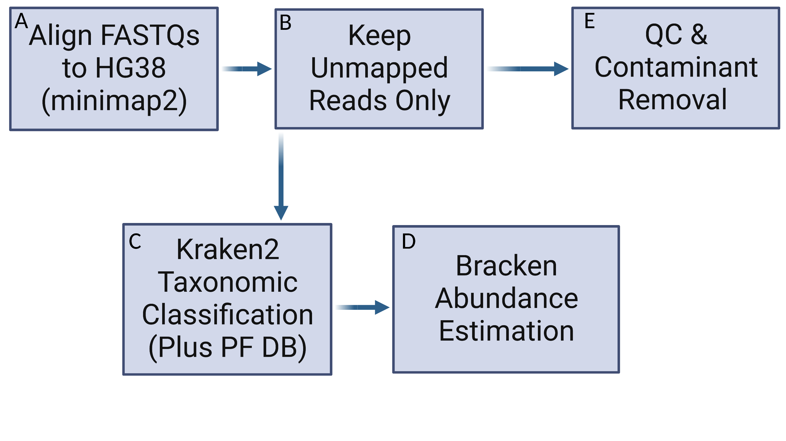

# WGS_TCGA_Pipeline
Snakemake Pipeline to Mine WGS Data for Contaminant Reads

<p align="center">
  
</p>


* This pipeline is not actually TCGA specific, but it does require as input WGS short reads  mapped against a human host genome in .bam format.
* Some code (namely, the sample parsing in samples.smk and decontamination in fastp.smk) has been borrowed and modified from [hecatomb](https://github.com/shandley/hecatomb).
* The only input required are the relevant BAM format files, which all must be placed in a certain directory specified with the 'Bams' config.
* Only software requirement is conda and that snakemake be in the $PATH. The rest of the required programs should install via conda
* extract_reads.py has been taken from [KrakenTools](https://github.com/jenniferlu717/KrakenTools#extract_kraken_readspy).

# Usage

1. Download the Kraken2 DB and host index.
* This needs to only be run once

```console
snakemake -c 1 -s DownloadDB.smk
```

2. Next the unaligned reads need to be extracted from the bams.

* This was split from the main pipeline due to the massive data size of the input data files (and so can be run independently of the main pipeline, allowing you to delete the raw BAMs once the unaligned reads have been extracted).
* All you need to specify is the Bams directory, and an output directory.

```console
snakemake -c 16 -s extract_unaligned_fastq --use-conda --config Bams=Bams/ Output=TCGA_Output/ 
```

3. Run the pipeline
* -c will modify the number of cores given to snakemake. 
* make sure you specify the same output using 'Output'

```console
snakemake -c 16 -s wgs_runner.smk --use-conda --config Output=my_output_dir/
```

Other Notes
======

* For offline only use (e.g. Adelaide Uni Phoenix HPC) - the conda envs need to be installed first on the login node in the pipeline directory before running step 3. above.

```console
snakemake -c 1 -s wgs_runner.smk --use-conda --config Output=my_output_dir/ --conda-create-envs-only --conda-frontend conda
```

* It it highly recommended that you run this piepline With a Slurm profile (see e.g. https://snakemake.readthedocs.io/en/stable/executing/cli.html https://github.com/Snakemake-Profiles/slurm https://fame.flinders.edu.au/blog/2021/08/02/snakemake-profiles-updated)
